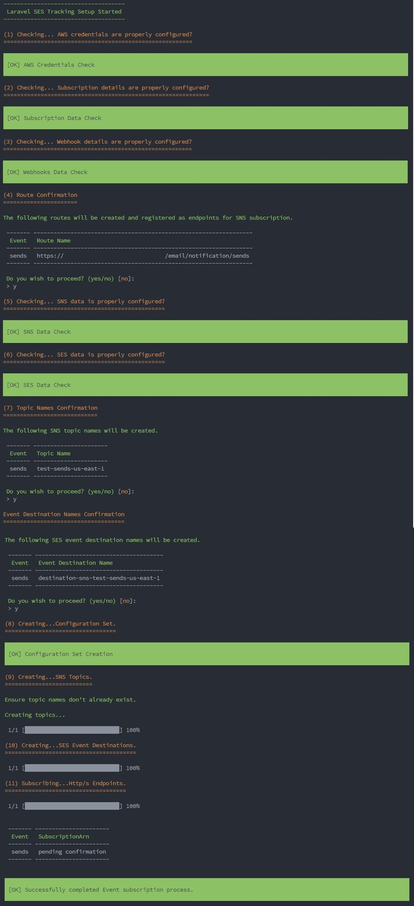

# Laravel SES Tracking
[](https://packagist.org/packages/akhan619/laravel-ses-tracking)

[](https://packagist.org/packages/akhan619/laravel-ses-tracking)
[](https://packagist.org/packages/akhan619/laravel-ses-tracking)
[](https://github.styleci.io/repos/480182263?branch=main)
[](https://packagist.org/packages/akhan619/laravel-ses-tracking)

Setup the AWS infrastructure to handle email events using SES/SNS and http/s endpoints with a single Laravel artisan command. This package is unopinionated in the sense that every setting can be changed as per your requirements. It follows an interactive CLI based setup process so that you know exactly what will be configured. Also, includes a debug mode where you can see all the settings and configurations that will be used without actually making the API calls. Finally, it can be very painful to clean up the AWS resources when an API call fails. For example, if you are trying to enable some advanced filter policy for an endpoint, only for that setting to fail, then you might have to go back and remove the configuration sets and SNS topics manually. To tackle the issue, the package will automatically try and revert any changes made to the AWS infrastructure when any exceptions occur.

## What this package does

As mentioned this package automates the process of:
-  Setting up the SES configuration set.
-  Setting up a SNS Topic.
-  Setting up the event destinations for the configuration set.
-  Subscribing the http/s endpoints to the SNS topic.

## What this package doesn't do

The package will not do anything beyond what is mentioned above. So, the package won't:
-  Add the created configuration set to your SES driver.
-  Manage the https/s subscription confirmation or actual processing of event messages from SNS.
-  Create the domains or endpoints with a Laravel project running (but won't that be awesome :smiley: ).

If you are looking for a package that will manage the incoming `SES` notifications and track email events then you may look at the [Laravel Ses Event Manager](https://github.com/akhan619/laravel-ses-event-manager) package. The `Laravel Ses Event Manager` package integrates nicely with this package and handles the processing and storage of email event notifications sent to the webhooks.

> **FULL DISCLOSURE**: I am the author of the `Laravel Ses Event Manager` package.

# Laravel and PHP Versions

The package is written for Laravel 9 and Php 8 and above.

# Overview of SES/SNS Event Notification Process

To understand the process of setting up event notifications for emails on AWS we must know the 2 key objects that will need to be set up on these services:
-  Configuration Set (`SES`)
-  Topic (`SNS`)

To receive notifications for emails on our http/s endpoints we first need to set up a `Configuration Set` on `SES`. The `Configuration Set` is used with the `ses` driver on Laravel. This tells `AWS` that we wish to send email event notifications to some listener.

The '`some listener`' in our case will be a `SNS` topic. This is specified by creating `Event Destinations`. An `Event Destination` serves 2 purposes:
-  It specifies which events to send notifications for.
-  It specifies where to send the event notifications.

Since we want to use `SNS` topics, we next need a `SNS` topic. The `SNS` topic receives event notifications from `SES`. When `SNS` receives a notification it will send a message to all the `subscribers` listening on the topic. In this case the `subscriber` will be a `http/s` endpoint.

So we need to create 4 objects:
-  Configuration Set
    -  Event Destination (Part of a configuration set)
-  Topic
    -  Subscription (Subscribes to a topic)

This a brief overview of what needs to be setup in order to enable http/s endpoints to receive email event notifications.
# Installation

Via Composer

```bash
$ composer require akhan619/laravel-ses-tracking
```

>  This package uses Laravel's package auto-discovery so there is no need to add the service provider in config/app.php

Configuration File

You can publish the configuration file using the following artisan command:
```bash
$ php artisan vendor:publish --provider="Akhan619\LaravelSesTracking\LaravelSesTrackingServiceProvider" --tag="config"
```

This is will publish a new configuration file called `laravel-ses-tracking.php` in the `config` folder.

# Usage

## Debug Mode

The package is configured by default to run in `debug mode`. This means that when you run the setup command, the package will show you all the configuration options that will be used for the actuall API calls including routes/topics/subscriptions etc. Debug mode can be turned off by setting `debug => FALSE` in the config.

> No API calls are made in debug mode. So you can test out the different configuration possibilities without making any changes to your AWS resources.

## Setup

Run the following command and follow the interactive steps.
``` bash
$ php artisan SesTracking:setup
```

You will have to confirm:
-  The Route names that will be used as endpoints.
-  The Topic names for SNS.
-  The Event Destination Names for SES.

Once you confirm all 3, the package will create and subscribe the endpoints to the SNS Topic. 

The `SubscriptionArns` will be printed to the console on Success. They will show `pending confirmation` unless you enable `ReturnSubscriptionArn` in the configuration.

## Example Run



## Confirming Subscription

You will need to set up the code on the actual endpoint service yourself to confirm subscription. Currently, you have 72 hours before the subscriptions expire to confirm the subscription. You may resend the confirmation message from the `AWS console`.

# Configuration

## AWS Credentials

AWS credentials are picked up from the .env file
```
AWS_ACCESS_KEY_ID=
AWS_SECRET_ACCESS_KEY=
AWS_DEFAULT_REGION=
```

If you wish to use a different set of credentials then specify them in the configuration file under the `ses` key.
```php
'ses' => [
    'key' => env('AWS_ACCESS_KEY_ID'),
    'secret' => env('AWS_SECRET_ACCESS_KEY'),
    'region' => env('AWS_DEFAULT_REGION'),
],
```

> Note: The AWS credentials must have permissions that allow 
> -  Creation of SES Configuration Sets
> -  Creation of SNS Topics 
> -  Creation of SES Event Destinations
> -  Subscribing an http/s Endpoint to a SNS Topic
>
> Since this is a topic in itself, please refer to the AWS docs to see what permissions need to be setup.

## SNS Protocol

Currently, 2 SNS protocols are supported `http/https`. The default is `https`. You may change the protocol under the `subscriber` key by setting one of them to `true`:

```php
'subscriber' => [
    'http' => FALSE, 
    'https' => TRUE,
],
```

## Domain and Scheme

By default, the package picks up the `domain` and `scheme` to use for the endpoint from the `APP_URL` in the `.env` file. If you wish to use a different endpoint than the project url, specify the values under the corresponding keys in the config file:

```php
'domain' => null, // If null the domain will be pulled from APP_URL. 
```

```php
'scheme' => null, // If null the scheme will be pulled from APP_URL. 
```

> Note: The scheme must match the subscriber SNS protocol, when using http/s subscribers.

## Events

You may specify exactly which email events that you want to listen to by setting the event to `true` in the `active` key:

```php
'active' => [
    'sends' => TRUE,
    'rendering_failures' => TRUE,
    'rejects' => FALSE,
    'deliveries' => FALSE,
    'bounces' => TRUE,
    'complaints' => FALSE,
    'delivery_delays' => FALSE,
    'subscriptions' => FALSE,
    'opens' => FALSE,
    'clicks' => FALSE,
],
```

## Routes

Routes are customizable for each event by specifying values for the `route_prefix` and the `routes` key:

```php
'route_prefix' => 'email/notification', // Set to null if no prefix is required.
```

```php
'routes' => [
    'sends' => 'sends',
    'rendering_failures' => 'rendering-failures',
    'rejects' => 'rejects',
    'deliveries' => 'deliveries',
    'bounces' => 'bounces',
    'complaints' => 'complaints',
    'delivery_delays' => 'delivery-delays',
    'subscriptions' => 'subscriptions',
    'opens' => 'opens',
    'clicks' => 'clicks',
],
```

The actual endpoint is then generated seperately for each event as:
```
scheme://domain/route_prefix/route
```

> Note: Routing endpoints are generated and subscribed only for the events that are enabled.

## Route Confirmation

When you run the setup command, the package will output to the console the http/s endpoints that will be configured on AWS (when running in Live mode user will be requested to confirm the routes). This allows you to make sure the endpoints are exactly as you want.

The output looks like (_based on a fresh laravel project with default values_):

| Event                     | Route Name |
| ------------------------- |:-----------|
| sends                     | https://localhost/email/notification/sends |
| deliveries                | https://localhost/email/notification/deliveries |
| bounces                   | https://localhost/email/notification/bounces |

## Configuration Set

The package creates a `Configuration Set` in `SES` that you may use with the emails that you want event notifications for. All the options that are available on the `AWS Console` can be set through the configuration file:

```php
'configuration_set' => [
    'ConfigurationSetName' => 'ses-event',

    'DeliveryOptions' => [
        'SendingPoolName' => null,

        'TlsPolicy' => 'REQUIRE',
    ],

    'ReputationOptions' => [
        'LastFreshStart' => null,

        'ReputationMetricsEnabled' => FALSE,
    ],

    'SendingOptions' => [
        'SendingEnabled' => TRUE,
    ],

    'SuppressionOptions' => [
        'SuppressedReasons' => [],
    ],

    'Tags' => [],

    'TrackingOptions' => [
        'CustomRedirectDomain' => null,
    ],
],
```

> Note: Some of the options here when enabled are charged seperately by `AWS`. You should check the defaults set here for your use case. Please refer to the `AWS docs` for how to set these options and what impact they have. 

## SNS Topics

Similar to route names, the topic name that is generated for every event can be modified by changing the `topic_name_prefix` , `topic_name_suffix` and the `topic_name` keys in the config as below:

```php
'topic_name_prefix' => env('APP_NAME', 'local'), // Set to null if no prefix is required.
```

```php
'topic_names' => [
    'sends' => 'sends',
    'rendering_failures' => 'rendering-failures',
    'rejects' => 'rejects',
    'deliveries' => 'deliveries',
    'bounces' => 'bounces',
    'complaints' => 'complaints',
    'delivery_delays' => 'delivery-delays',
    'subscriptions' => 'subscriptions',
    'opens' => 'opens',
    'clicks' => 'clicks',
],
```
```php
'topic_name_suffix' => 'us-east-1', // Set to null if no prefix is required.
```

## SNS Topic Configuration

When creating a SNS topic, there are other options that can be set besides the name. For example you may want to enable at-rest encryption for the payload or define a delivery retries policies. These can be specificied under the key `sns_topic_configuration_data` in the config file. Please refer to the `AWS docs` to see how to set them properly.

```php
'DeliveryPolicy' => [],

'Policy' => [],

'KmsMasterKeyId' => null,

'Tags' => [],
```

## SNS Topic Names Confirmation

When you run the setup command, the package will output to the console the SNS topics that will be configured on AWS (when running in Live mode user will be requested to confirm the topic names). This allows you to make sure the topic names are exactly as you want.

The output looks like (_based on a fresh laravel project with default values_):

| Event                     | Topic Name |
| ------------------------- |:-----------|
| sends                     | Laravel-sends-us-east-1 |
| deliveries                | Laravel-deliveries-us-east-1 |
| bounces                   | Laravel-bounces-us-east-1 |

## Event Destination Names

Just like before, event destination names can be customized on a per event basis by changing the self-explantory config options below:

```php
'event_destination_prefix' => 'destination',
```

```php
'destination_names' => [
    'sends' => 'sns',
    'rendering_failures' => 'sns',
    'rejects' => 'sns',
    'deliveries' => 'sns',
    'bounces' => 'sns',
    'complaints' => 'sns',
    'delivery_delays' => 'sns',
    'subscriptions' => 'sns',
    'opens' => 'sns',
    'clicks' => 'sns',
],
```

```php
'event_destination_suffix' => 'us-east-1',
```

If instead, you want to attach the Topic names as a suffix for the event destinations, to help with tracking, then set the following option to `TRUE`.

```php
'topic_name_as_suffix' => TRUE,
 ```

 Setting this to `TRUE` disables the `event_destination_suffix`.

 ## Event Destination Names Confirmation

When you run the setup command, the package will output to the console the SES Event Destination names that will be configured on AWS (when running in Live mode user will be requested to confirm the destination names). This allows you to make sure the destination names are exactly as you want.

The output looks like (_based on a fresh laravel project with default values_):

| Event                     | Event Destination Name |
| ------------------------- |:-----------|
| sends                     | destination-sns-Laravel-sends-us-east-1 |
| deliveries                | destination-sns-Laravel-deliveries-us-east-1 |
| bounces                   | destination-sns-Laravel-bounces-us-east-1 |

## Subscription Configuration

You may specify additional options when subscribing an endpoint to a `SNS` Topic under the `sns_subscription_configuration_data` key in the config file. Currently you can set the following options:

```php
'ReturnSubscriptionArn' => false,
```

```php
'DeliveryPolicy' => [],
```

```php
'FilterPolicy ' => [],
```

```php
'RawMessageDelivery' => 'false',
```

```php
'RedrivePolicy' => null,
```

Please refer to `AWS docs` for further details on how to use these settings.

# Rollback on Failure

Making API calls always entail failure possibility. So every configuration setting is extensively validated before making the calls. Still, API calls can fail. Maybe, the `topic name` already exists. Since this is a multi-step process, you maybe left with wasted resources that you would have to go and clear yourself. So the package tries to roll back to a clean state. This means it will delete the `Configurations Set` and/or the  `Topic` that was created on a failure of the succeding steps. This should be enough for most cases. But, it might be that the call to delete these resources themselves fail. In that case, a manual clean-up is required sadly. 

> If you are in this boat then as a consoloation, this developer had to manually clean up many times while this package was being developed.

## Change log

Please see the [changelog](changelog.md) for more information on what has changed recently.

## Testing

Run the tests with

```bash
$ composer test
```

## RoadMap

-   ~~Add tests!!!~~
-   Add a option to the command to answer yes to all confirmations.
-   Add a seperate command to delete the AWS resources that were created. A way for users to test and clear AWS resources.
-   Add other protocols such as SQS.


## Contributing

Please see [contributing.md](contributing.md) for details and a todolist.

## Security

If you discover any security related issues, please email amankhan.mailbox@gmail.com instead of using the issue tracker.

## Credits

- Aman Khan

## License

MIT. Please see the [license file](license.md) for more information.
